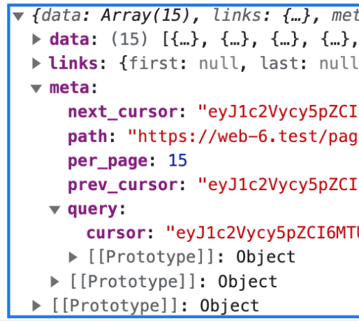
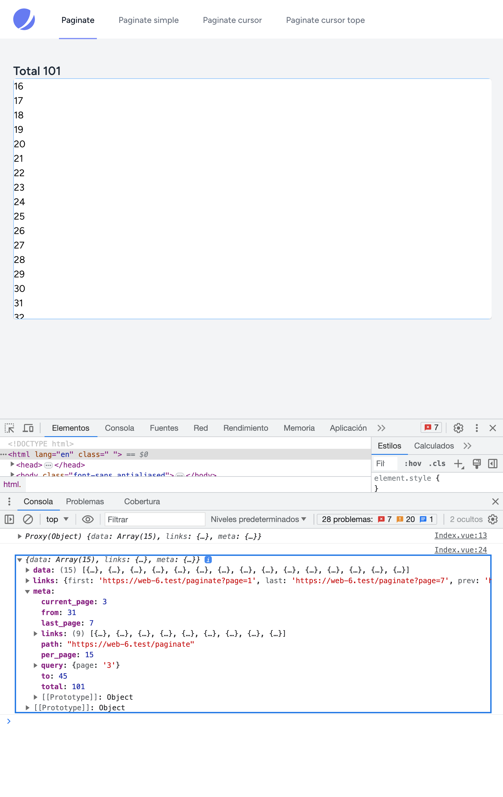
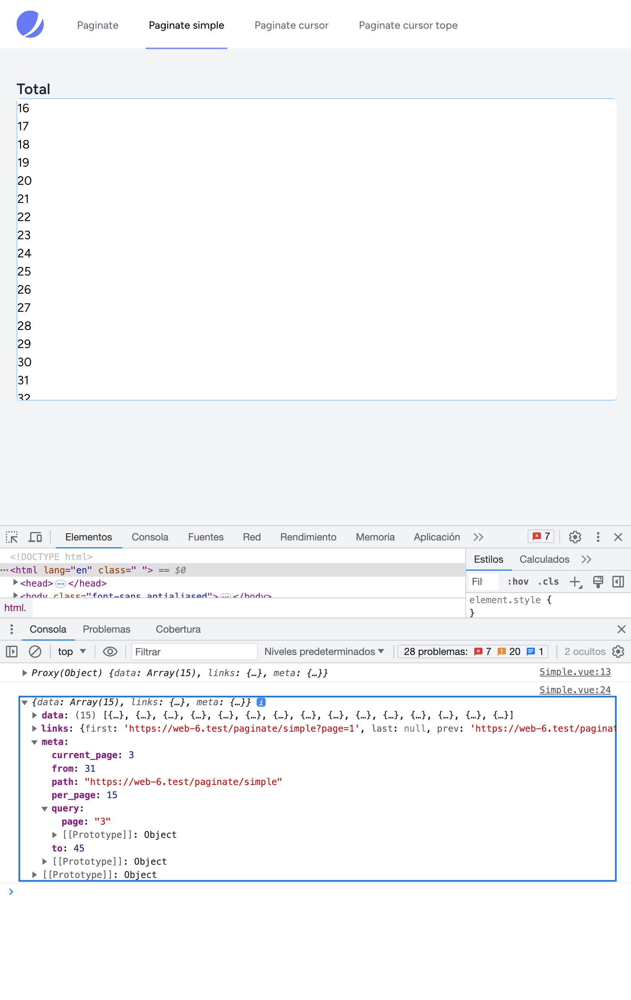
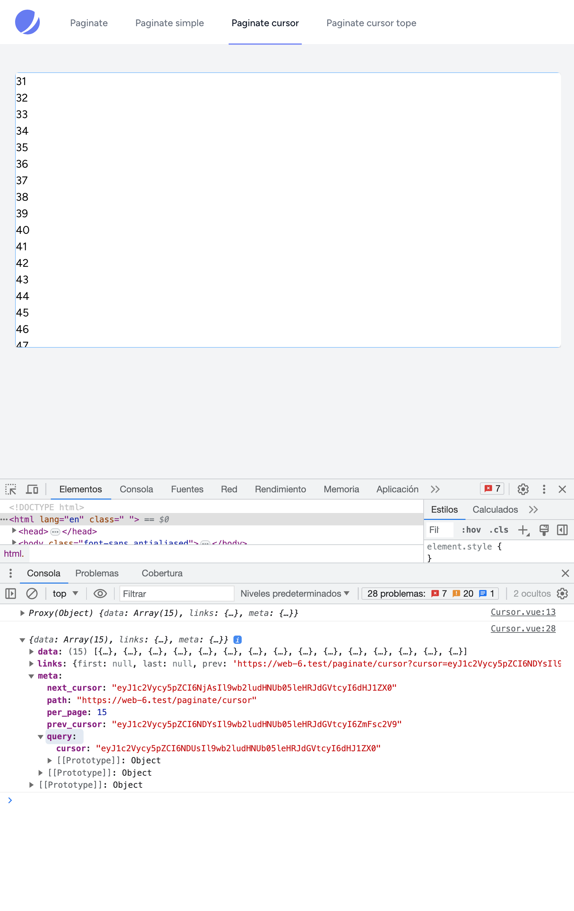
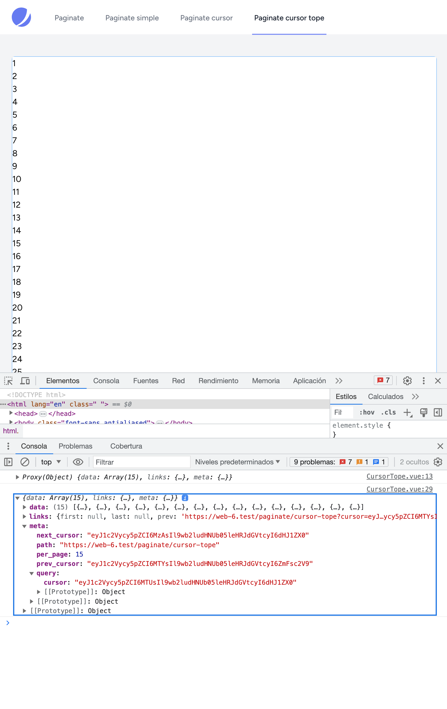

<a name="readme-top"></a>

<div align="center">

[![Contributors][contributors-shield]][contributors-url]
[![Forks][forks-shield]][forks-url]
[![Stargazers][stars-shield]][stars-url]
[![Issues][issues-shield]][issues-url]
[![MIT License][license-shield]][license-url]
[![LinkedIn][linkedin-shield]][linkedin-url]

[![Laravel][Laravel.com]][Laravel-url]
[![Vue][Vue.js]][Vue-url]

</div>

<br />
<div align="center">
  <a href="https://github.com/victorbondaruk/laravel-10-inertia-pagination">
    
  </a>

  <h3 align="center">Laravel 10 Inertia Pagination</h3>

  <p align="center">
    <br />
    Laravel 10 with Inertia vue.js where the different pagination and infinite scroll techniques are exemplified.
  </p>
</div>


## Built with
- [Laravel 10](https://github.com/laravel/framework)
- [Vue 3](https://vuejs.org/)
- [Tailwind CSS](https://tailwindcss.com/)
- [Inertiajs](https://inertiajs.com/)
- [Laravel - Paginator](https://laravel.com/docs/10.x/pagination#cursor-paginator-instance-methods)

## Installation

```sh
git clone https://github.com/victorbondaruk/laravel-10-inertia-pagination.git
```

#### Base de datos

```sh
php artisan migrate:refresh --seed
```

### With Docker Desktop
- To get started, you need to install [Docker Desktop](https://www.docker.com/products/docker-desktop).
- You may run the following command in your terminal
- Windows open WSL2 Linux terminal. [Docker Desktop WSL 2 backend](https://docs.docker.com/desktop/windows/wsl/)
- `docker run --rm -v "$(pwd)":/opt -w /opt laravelsail/php82-composer:latest bash -c "git clone https://github.com/victorbondaruk/laravel-10-inertia-pagination.git && cd laravel-10-inertia-pagination && php artisan sail:install --with=mysql,redis,meilisearch,mailpit,selenium"`
- `cd laravel-10-inertia-pagination`
- `./vendor/bin/sail pull mysql redis meilisearch mailpit selenium`
- `./vendor/bin/sail build`
- `./vendor/bin/sail up`
- Create a new MYSQL database and update database details in `.env` file
- `./vendor/bin/sail artisan migrate --seed`
- `./vendor/bin/sail npm install`
- `./vendor/bin/sail npm run build`
- `./vendor/bin/sail npm run dev`
- `php artisan serve`
- Now open http://localhost:8000/


## Screenshots
<p align="center">
	
	<br/><br/>
	
	<br/><br/>
	
    <br/><br/>
	
	<br/><br/>
</p>


## Test

```sh
php artisan test
```

## License

The Laravel framework is open-sourced software licensed under the [MIT license](https://opensource.org/licenses/MIT).


<p align="right">(<a href="#readme-top">back to top</a>)</p>


## Contact

Project Link: [https://github.com/victorbondaruk](https://github.com/victorbondaruk)

<p align="right">(<a href="#readme-top">back to top</a>)</p>


<!-- MARKDOWN LINKS & IMAGES -->
<!-- https://www.markdownguide.org/basic-syntax/#reference-style-links -->
[contributors-shield]: https://img.shields.io/github/contributors/victorbondaruk/laravel-10-inertia-pagination.svg?style=for-the-badge
[contributors-url]: https://github.com/victorbondaruk/laravel-10-inertia-pagination/graphs/contributors

[forks-shield]: https://img.shields.io/github/forks/victorbondaruk/laravel-10-inertia-pagination.svg?style=for-the-badge
[forks-url]: https://github.com/victorbondaruk/laravel-10-inertia-pagination/network/members

[stars-shield]: https://img.shields.io/github/stars/victorbondaruk/laravel-10-inertia-pagination.svg?style=for-the-badge
[stars-url]: https://github.com/victorbondaruk/laravel-10-inertia-pagination/stargazers

[issues-shield]: https://img.shields.io/github/issues/victorbondaruk/laravel-10-inertia-pagination.svg?style=for-the-badge
[issues-url]: https://github.com/victorbondaruk/laravel-10-inertia-pagination/issues

[license-shield]: https://img.shields.io/github/license/victorbondaruk/laravel-10-inertia-pagination.svg?style=for-the-badge
[license-url]: https://github.com/victorbondaruk/laravel-10-inertia-pagination/blob/master/LICENSE

[linkedin-shield]: https://img.shields.io/badge/-LinkedIn-black.svg?style=for-the-badge&logo=linkedin&colorB=555
[linkedin-url]: https://linkedin.com/in/victorbondaruk

[Vue.js]: https://img.shields.io/badge/Vue.js-35495E?style=for-the-badge&logo=vuedotjs&logoColor=4FC08D
[Vue-url]: https://vuejs.org/

[Laravel.com]: https://img.shields.io/badge/Laravel-FF2D20?style=for-the-badge&logo=laravel&logoColor=white
[Laravel-url]: https://laravel.com